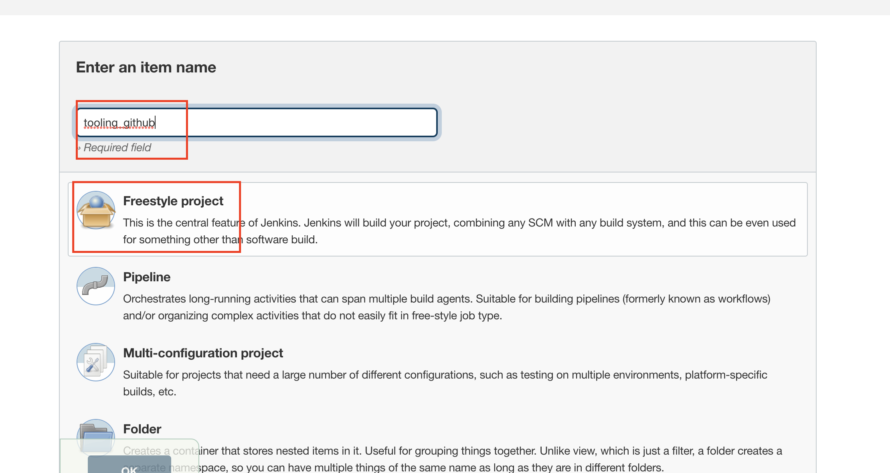

## TOOLING WEBSITE DEPLOYMENT AUTOMATION WITH CONTINUOUS INTEGRATION. INTRODUCTION TO JENKINS

In previous projects, we have deployed 2 webservers (horizontal scalability) and also implemented a load balancer to split traffic between these two webservers. In the event that we need to do this task for hundreds of servers, doing them manually will be time consunming and as such `AUTOMATION` of routines tasks is a key cornerstone of Devops to ensure `agility`. 

Project 9 will see automation of some routine tasks using the automation server called `Jenkins` This is one of the most popular `CI/CD` tools. 

Continuous integration (CI) is a software development strategy that increases the speed of development while ensuring the quality of the code that teams deploy. Developers continually commit code in small increments (at least daily, or even several times a day), which is then automatically built and tested before it is merged with the shared repository.

CD is continous delivery. 

In this project, we are going to utilize Jenkins CI capabilities to make sure that every change made to the source code in GitHub https://github.com/<yourname>/tooling will be automatically be updated to the Tooling Website.

You need to go to the Darey tooling repository and create a fork of this repo which is located at `https://github.com/darey-io/tooling.git`

Here is how your updated architecture will look like upon competion of this project:

### INSTALL AND CONFIGURE JENKINS SERVER
1. Step 1 – Install Jenkins server
2. Create an AWS EC2 server based on Ubuntu Server 20.04 LTS and name it "Jenkins"

Install JDK (since Jenkins is a Java-based application) using the following code:

`sudo apt update`

`sudo apt install default-jdk-headless`

3. Install Jenkins using the following code:

`wget -q -O - https://pkg.jenkins.io/debian-stable/jenkins.io.key | sudo apt-key add -`

`sudo sh -c 'echo deb https://pkg.jenkins.io/debian-stable binary/ > \
    /etc/apt/sources.list.d/jenkins.list'`

`sudo apt update`

`sudo apt-get install jenkins`

Make sure Jenkins is up and running by checking the status of the service:

`sudo systemctl status jenkins`

4. By default Jenkins server uses TCP port 8080 – open it by creating a new Inbound Rule in your EC2 Security Group. 

5. Perform initial Jenkins setup.
From your browser access 

`http://<Jenkins-Server-Public-IP-Address-or-Public-DNS-Name>:8080`

In this case, the address entered into the browser is below:

`http://44.204.4.119:8080/`

You will be prompted to provide a default admin password

Copying the link in the screenshot above takes me to the password location once I enter this in my terminal with `sudo cat` before the actual code. 

`sudo cat /var/lib/jenkins/secrets/initialAdminPassword`

Once password has been entered, the page takes us to the customise jenkins page below:

From here, I will click on `install sugessted pluggins`

The next page will ask you to create a new user:

The next page will show you your jenkins server address:

Saving the previous page will then complate the installation of jenkins:

### Step 2 – Configure Jenkins to retrieve source codes from GitHub using Webhooks

In this part, you will learn how to configure a simple Jenkins job/project (these two terms can be used interchangeably). This job will will be triggered by GitHub webhooks and will execute a ‘build’ task to retrieve codes from GitHub and store it locally on Jenkins server.

1. Enable webhooks in your GitHub repository settings (Note that I previously created a tooling repository in GitHub and this is what we will be using here)

Go to Repository >> Setting >> Webhook >> Add new webhook 

make the modification in the snapshot below to this page and then add webhook

The address is http://<Jenkins Server Public IP Address:8080>/github-webhook/

The real address entered is shown below:

`http://44.203.86.93:8080/github-webhook/`

Save the configuration and let us try to run the build. For now we can only do it manually.

Click "Build Now" button, if you have configured everything correctly, the build will be successfull and you will see it under `#1`

http://44.204.4.119:8080/github-webhook/

Also change the content type to `application/json`

2. Go to Jenkins web console, click "New Item" and create a "Freestyle project" and click ok

To connect your GitHub repository, you will need to provide its `HTTPS` URL, you can copy from the GitHub repository itself

Now you paste the GitHub address in the source code management for Jenkins. Ensure you have selected Git for source code management. You also need to enter a creadential for Git (this is the username and password for your GitHub account.)

Once you ahve saved the credentials, you can run the build and the sucessful run is shown below from console output:

Note that this build only runs when we trigger it manually so we want to fix this in the following steps:

### Click "Configure" your job/project and add these two configurations

Configure triggering the job from GitHub webhook:
(select `github hook trigger` under `build triggers` as shown below:)

Go to `build`, under `post build actions` click on `archive the artifacts` and enter `**` The two starts means all the fliles/artifcats will be archived

Click Apply & Save

Now, I will make a small change to the readme.md file in the tooling repository & commit the change and push the changes to the master branch. (ensure master branch is selected before you commit)

You will see that a new build has been launched automatically (by webhook) and you can see its results – artifacts, saved on Jenkins server.

Below is a snapshot of the Artifacts

You have now configured an automated Jenkins job that receives files from GitHub by webhook trigger (this method is considered as ‘push’ because the changes are being ‘pushed’ and files transfer is initiated by GitHub). There are also other methods: trigger one job (downstreadm) from another (upstream), poll GitHub periodically and others.

By default, the artifacts are stored on Jenkins server locally (remember to use correct name of Jenkins project and the correct build number)

`ls /var/lib/jenkins/jobs/<Name-of-Jenkins-Project>/builds/<build_number>/archive/`

Below are the artifcats after running the command above:

## CONFIGURE JENKINS TO COPY FILES TO NFS SERVER VIA SSH

## Step 3 – Configure Jenkins to copy files to NFS server via SSH

Now we have our artifacts saved locally on Jenkins server, the next step is to copy them to our NFS server to `/mnt/apps` directory.

Jenkins is a highly extendable application and there are 1400+ plugins available. We will need a plugin that is called "Publish Over SSH".

1. Install "Publish Over SSH" plugin.
On main dashboard select "Manage Jenkins" and choose "Manage Plugins" menu item.

On "Available" tab search for "Publish Over SSH" plugin and install it

2. Configure the job/project to copy artifacts over to NFS server.

On main dashboard select "Manage Jenkins" and choose "Configure System" menu item.

Scroll down to Publish over SSH plugin configuration section and configure it to be able to connect to your NFS server:

1. Provide a private key (content of .pem file that you use to connect to NFS server via SSH/Putty).Now you click  `add ssh servers` and configure per below

2. Arbitrary name (use `NFS`)
3. Hostname – can be private IP address of your NFS server
4. Username – ec2-user (since NFS server is based on EC2 with RHEL 8)
5. Remote directory – /mnt/apps since our Web Servers use it as a mointing point to retrieve files from the NFS server

Below is the configuration used for setting up the ssh server on Jenkins

Test the configuration and make sure the connection returns Success. Remember, that TCP port 22 on NFS server must be open to receive SSH connections.

Save the configuration, open your Jenkins job/project configuration page and add another one "Post-build Action"

Configure it to send all files produced by the build into our previouslys define remote directory (/mnt/apps) and ensure the previously defined SSH server titled "NFS" is selected. In our case we want to copy all files and directories – so we use ** and then save. 

Note, because you will be publishing to /mnt/apps on NFS server, do ensure you have the right permission by running the followoing code on the NFS server:

`sudo chown -R nobody:nobody /mnt`
`sudo chmod -R 777 /mnt`

If you dont to the above, you will get a permission denied error. 

Webhook will trigger a new job and in the "Console Output" of the job you will find something like this:

Below shows the artificats which are now on the /mnt/apps folder of the NFS server:

To make sure that the files in /mnt/apps have been udated – connect via SSH/Putty to your NFS server and check README.MD file

`cat /mnt/apps/README.md`

If you see the changes you had previously made in your GitHub – the job works as expected.

At the bottom of the image is the change made to the readme file "checking jenkins"

This is the end of Project9
